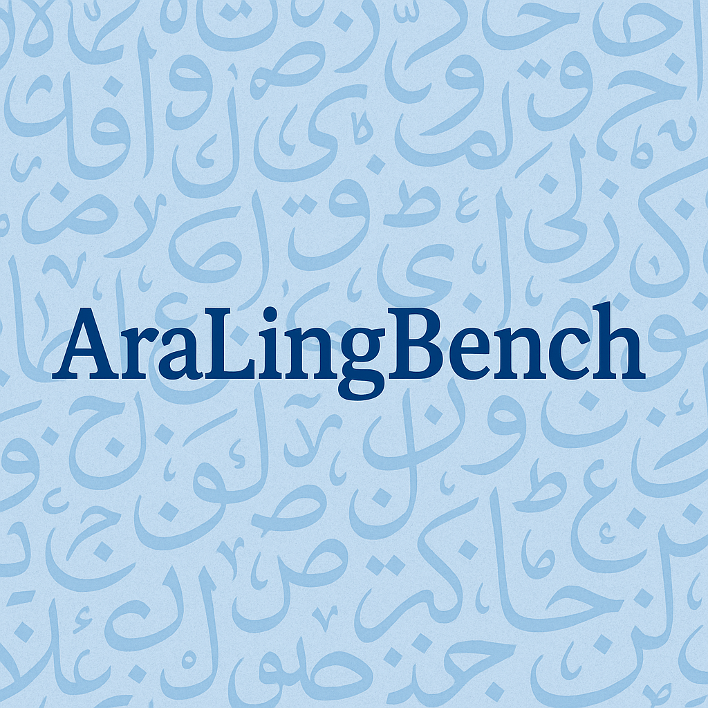

<h1 align="center">AraLingBench</h1>
<p align="center"><em>A human-annotated benchmark stress-testing the Arabic linguistic core of large language models.</em></p>

<p align="center">
  <a href="https://arxiv.org/abs/XXXX.XXXXX"></a>
  <a href="https://huggingface.co/datasets/hasanhammoud/arabench"></a>
  
  
</p>

<p align="center"><strong>Mohammad Zbib<sup>1,2†</sup>, Hasan Abed Al Kader Hammoud<sup>1†</sup>, Sina Mukalled<sup>2</sup>, Nadine Rizk<sup>2</sup>, Fatima Karnib<sup>2</sup>, Issam Lakkis<sup>2</sup>, Ammar Mohanna<sup>2</sup>, Bernard Ghanem<sup>1</sup></strong></p>
<p align="center"><sub><sup>1</sup>King Abdullah University of Science and Technology (KAUST), <sup>2</sup>American University of Beirut (AUB), <sup>†</sup>Equal contribution</sub></p>
<p align="center">
  
</p>
<div align="center">
<table>
<tr>
<td>
<strong>TL;DR:</strong> AraLingBench is a 150-question, expert-authored benchmark that isolates five fundamental pillars of Arabic proficiency - grammar, morphology, spelling, reading comprehension, and syntax - to diagnose whether LLMs possess genuine linguistic competence rather than surface-level fluency.
</td>
</tr>
</table>
</div>

## Why AraLingBench?
- **Linguistic-first focus:** Existing Arabic benchmarks emphasize knowledge recall and general reasoning; AraLingBench explicitly measures structural language understanding.
- **Human-authored and validated:** All items are original creations vetted by trained Arabic linguists and reviewed for clarity, difficulty, and single-answer correctness.
- **Granular diagnosis:** Balanced coverage across five linguistic categories exposes which capabilities each model truly masters.

## Benchmark at a Glance

| Dimension | Details |
| --- | --- |
| Total questions | 150 multiple-choice prompts authored by experts |
| Categories | Grammar, Morphology, Spelling & Orthography, Reading Comprehension, Syntax (30 items each) |
| Difficulty | 33% Easy, 49% Medium, 17% Hard (annotated by majority vote) |
| Answer format | 83% four-choice, 17% three-choice items; balanced answer key (A: 34%, B: 27.3%, C: 26%, D: 12.7%) |
| Evaluation protocol | Zero-shot, single-letter responses scored by accuracy per category and overall |

## Crafting the Benchmark
1. **Question Generation:** Five experts authored novel problems rooted in real linguistic phenomena (Nahw, Sarf, Imlaa, Fahm al-logha, Tarkib Lughawi).
2. **Filtering for Diversity & Difficulty:** Native speakers validated clarity and ensured each item remained non-trivial and covered unique skills.
3. **Expert Quality Control:** A senior linguist enforced strict category alignment, unambiguous wording, and exactly one correct answer.
4. **Difficulty Annotation:** Three independent annotators labeled each item (Easy/Medium/Hard) via majority vote, yielding an intentionally medium-heavy set for discriminative power.

## Leaderboard Snapshot
| Model | Spelling | Syntax | Morphology | Grammar | Reading | Avg |
| --- | --- | --- | --- | --- | --- | --- |
| Navid-AI/Yehia-7B-preview | 86.7 | 53.3 | 80.0 | 80.0 | 70.0 | **74.0** |
| ALLaM-7B-Instruct-preview | 86.7 | 60.0 | 73.3 | 73.3 | 76.7 | **74.0** |
| Yehia-7B-Reasoning-preview | 80.0 | 50.0 | 80.0 | 76.7 | 73.3 | 72.0 |
| Yehia-7B-DPO-Reasoning-preview | 80.0 | 50.0 | 80.0 | 76.7 | 73.3 | 72.0 |
| Yehia-7B-SFT-Reasoning-preview | 76.7 | 36.7 | 66.7 | 76.7 | 73.3 | 66.0 |
| tempmotacilla-cinerea-0308 | 63.3 | 60.0 | 60.0 | 60.0 | 70.0 | 62.7 |
| Qwen2.5-Lumen-14B | 70.0 | 56.7 | 63.3 | 60.0 | 60.0 | 62.0 |
| Saka-14B | 66.7 | 56.7 | 63.3 | 60.0 | 60.0 | 61.3 |
| SUHAIL-14B-preview | 60.0 | 60.0 | 70.0 | 63.3 | 53.3 | 61.3 |
| lambda-qwen2.5-14b-dpo-test | 70.0 | 60.0 | 60.0 | 60.0 | 56.7 | 61.3 |

## Getting Started

### 1. Install the evaluation harness
```bash
pip install -e .
```

### 2. Evaluate a model
Use the provided evaluation script to run both difficulty-level and category-level evaluations:

```bash
bash run_arabench_single_model.sh
```

The script evaluates models on:
- **Difficulty levels**: Easy, Medium, Hard
- **Linguistic categories**: Grammar (النحو), Morphology (الصرف), Spelling (الإملاء), Syntax (التركيب اللغوي والأسلوبي), Reading Comprehension (فهم اللغة)

To evaluate your own model, edit the `MODEL` variable in `run_arabench_single_model.sh`:
```bash
MODEL="your-org/your-model-name"
```

## Citation

If you use AraLingBench in your research, please cite our work:

```bibtex
@article{zbib2025aralingbench,
  title        = {AraLingBench: A Human-Annotated Benchmark for Evaluating Arabic Linguistic Capabilities of Large Language Models},
  author       = {Mohammad Zbib and Hasan Abed Al Kader Hammoud and Sina Mukalled and Nadine Rizk and Fatima Karnib and Issam Lakkis and Ammar Mohanna and Bernard Ghanem},
  journal      = {arXiv preprint arXiv:XXXX.XXXXX},
  year         = {2025},
  archivePrefix= {arXiv},
  primaryClass = {cs.CL},
  url          = {https://arxiv.org/abs/XXXX.XXXXX}
}
```

